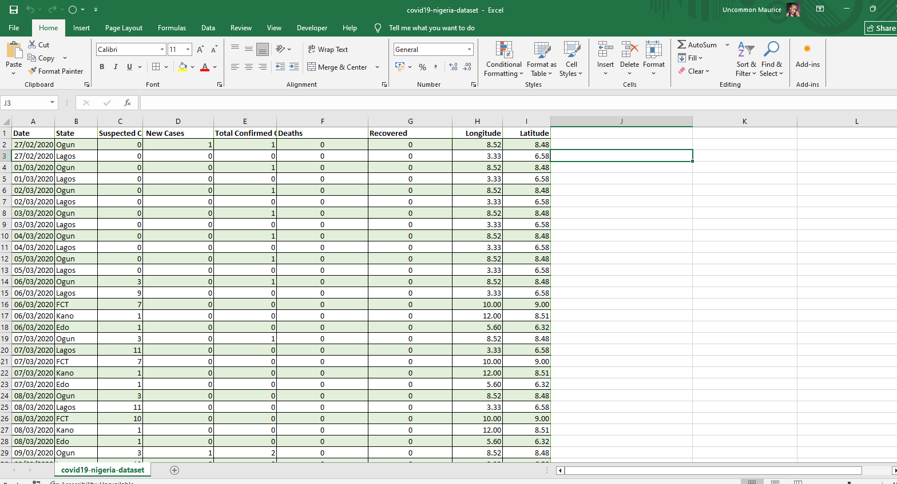
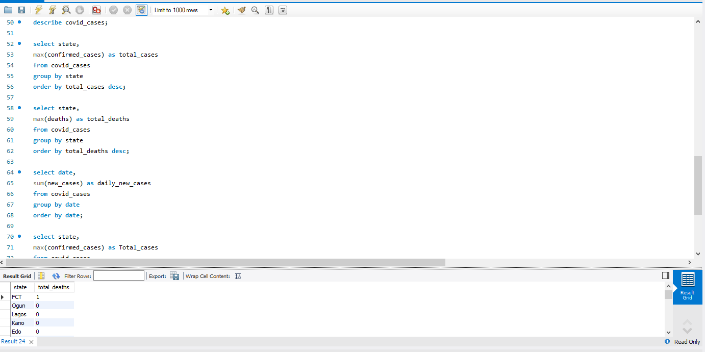
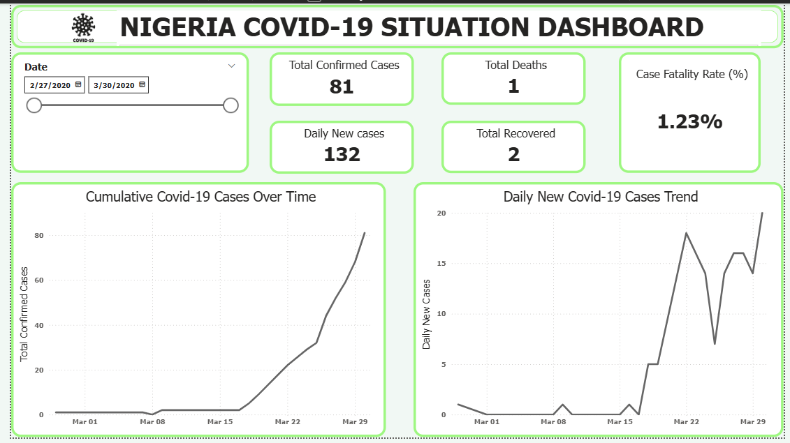
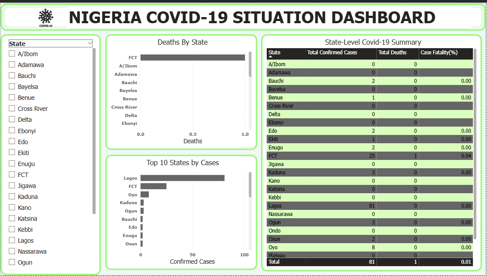

# COVID-19 Data Analysis 🦠

## 📌 Overview
This project analyzes global COVID-19 data to understand trends in cases, deaths, and recovery rates.

---

## 🧠 Tools Used
- Excel / SQL / Power BI 

---

## 📊 Business Questions Answered
- How did COVID-19 spread over time?
- Which regions were most affected?
- What are the trends in recovery and mortality rates?

---

## 📈 Dashboard Preview

---

## 🔍 Key Insights
- Certain regions were more affected than others
- Cases increased in waves over time
- Recovery rates improved over time with interventions

---

## 📌 Conclusion
This analysis provides insights into the global impact and progression of COVID-19.
